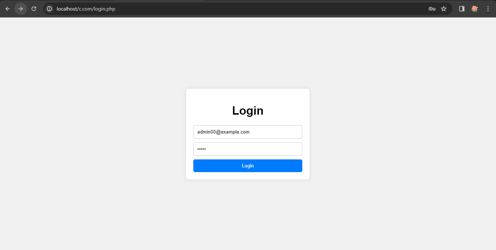

<h1>User Management</h1>
<h4>Based on CRUD, user management, we want to restrict access to this part of the application using an authentication system. The user's actions will be controlled according to their role:</h4>

<h4>Log-In</h4>

<h4>Invalid Log-In</h4>

<h4>User manager</h4>

<h4>Edit Users</h4>

<h4>Delete User</h4>

